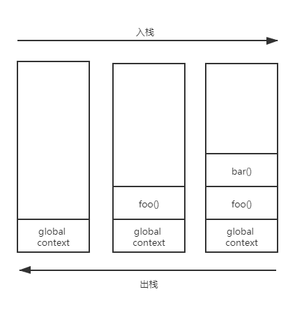
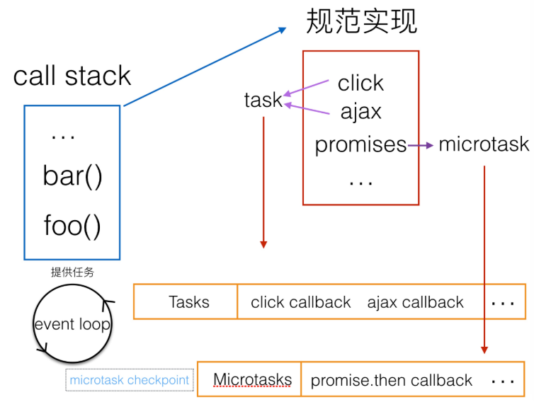

# event loop 事件循环

说到 event loop，不得不提的是： JavaScript 是单线程的。即一次只能做一件事情。Event Loop 就是让 JavaScript 在运行时具有并发的能力。

## 1. 同步任务与异步任务

```javascript
// global sync task

function add(a, b) {
  return a + b;
}

// add sync task
const sum = add();

// bar async task
setTimeout(function bar() {
  console.log('bar called!');
}, 1000);

// fetchUsers async task
fetch('https://www.example.com/api/v1/users').then(function fetchUsers(res) {
  console.log({ res });
});
```

- 上面的脚本中包含同步任务有 `global task` 和 `foo task`，包含的异步任务有 `bar task`
- 同步：函数被调用时能够立即得到结果
- 异步：函数被调用时，不能立即得到返回值，而是在将来的某个时刻得到返回值

## 2. 执行栈

要想理解 Event Loop，就得先了解 JavaScript 中的 `执行栈`（JavaScript execution context stack）

JavaScript 是单线程的，只有一个主线程。在这个主线程中，有一个栈。

在每个函数 `运行时`，会生成一个 `执行上下文（execution context）`，这个执行上下文包含了当前函数运行时的参数，局部变量等信息。

`开始执行函数` 时，执行上下文会被 `推到执行栈中`；`函数执行完毕后`，这个 `执行上下文又会从栈中弹出`。

例子

```javascript
function foo() {
  console.log('foo');
}

function bar() {
  console.log('bar');
  foo();
}

bar();
```

- 如下图所示



- 入执行栈：
- 整个脚本开始运行，`global 执行上下文` 被推入 `执行栈` 中
- `bar()` 函数开始运行，`bar() 函数执行上下文` 被推入 `执行栈` 中
- `foo()` 函数开始运行，`foo() 函数执行上下文` 被推入 `执行栈` 中

- 出执行栈：
- `foo()` 函数执行完毕，弹出
- `bar()` 函数执行完毕，弹出

总结：`执行栈` 相当于一条流水线，所有的 `同步任务` `运行时`，都会被放到这条流水线上去一个一个 `按照顺序（函数调用顺序）` 执行。

既然 `同步任务运行时` 是被放到 `执行栈` 中，那 `异步任务运行时以及定义时` 是被放到哪里呢？

## 2. macrotask 和 microtask

在异步任务中，又分为两类任务：

- macrotask：宏任务
- microtask：微任务

要回答上面这个问题，首先了解一下 `macrotask` 和 `microtask`。

### 2.1. macrotask 宏任务

以下派发的任务就是 macrotask

- setTimeout
- setInterval
- setImmediate
- I/O（如：网络请求）
- UI rendering

每一个 Event Loop 都有一个 `macrotask 队列`：

```javascript
setTimeout(function foo() {
  console.log('foo');
}, 1000);

setTimeout(function bar() {
  console.log('foo');
}, 2000);
```

- `foo()` macrotask 在 1000ms 后被推入 `macrotask 队列` 中
- `bar()` macrotask 在 2000ms 后被推入 `macrotask 队列` 中

### 2.2. microtask 微任务

以下派发的任务时 microtask：

- process.nextTick
- promises
- Object.observe
- MutationObserver

每一个 Event Loop 都有一个 `microtask 队列`：

```javascript
// 调用 Promise 构造函数时，传入的回调是会立即调用的，所以 foo 不算 microtask
// new Promise(function foo(resolve) {
//   console.log('foo');
//   resolve();
// });

// 调用 Promise 构造函数时，传入的回调是会立即调用的，所以 bar 不算 microtask
// new Promise(function bar(resolve) {
//   console.log('bar');
//   resolve();
// });

Promise.resolve()
  .then(function foo() {
    console.log('promise1');
  })
  .then(function bar() {
    console.log('promise2');
  });
```

- `foo()` microtask 被推入 `microtask 队列` 中
- `bar()` microtask 被推入 `microtask 队列` 中

所以，现在来看看上面的问题：

- `异步任务` `运行时` 以及 `定义时` 是被放到哪里呢？
  答：
- 如果 `异步任务` 属于 `macrotask`，则在 `定义时` 被放到 `macrotask 队列` 中；如果 `异步任务` 属于 `microtask`，则在 `定义时` 被放到 `microtask 队列` 中

上面只回答了 `异步任务` `定义时` 被放置的位置。接下来通过 Event Loop 来回答 `异步任务` 在 `运行时` 会在哪里。

## 3. Event Loop

上面讲了：

- 同步任务：同步任务在 `代码层面`，存在 `定义状态` 和 `执行状态`。在 `执行状态` 时被推入 `执行栈` 中执行
- 异步任务：异步任务在 `代码层面`，只存在 `定义状态`。异步任务在 `定义时`，根据异步任务的类型，被推入不同的队列中
  - macrotask 宏任务
  - microtask 微任务
- 执行栈：所有的任务都会在 `运行时` 被推入到 `执行栈` 中执行

但上面还留下了一个问题：`异步任务` 在 `运行时` 会在哪里？

这个时候，就需要知道 Event Loop 了。

Event Loop 翻译成中文为 `事件循环`。`循环` 二字，就说明了 Event Loop 表示是一个在不断 `循环` 的过程。

这个 `循环` 包含了以下过程：

1. 检查 `执行栈` 中的所有任务是否全部执行完毕了。若未执行完，则继续执行；否则进入下一步
2. 检查 `microtask 队列` 是否存在 `microtask`。若存在 `microtask`，则将 `microtask 队列` 中的所有 `microtask` 都推入 `执行栈` 中执行（否则进入下一步）。执行完毕后，进入下一步
3. 检查 `macrotask 队列` 中是否存在 `macrotask`。若存在 `macrotask`，则将 `macrotask 队列` 中的 `第一个` 出队，推入到 `执行栈` 中执行（否则进入第 1 步，一个 Event Loop 完成）。执行完毕后，进入第 1 步（一个 Event Loop 完成）



- 一个 Event Loop，包含了上面三个步骤

所以，现在可以回答上面的问题了：`异步任务` 在 `运行时` 会经过 Event Loop，且被推入到 `执行栈` 中。

## 4. 总结

Event Loop（事件循环）就是一个对 `异步任务` 进行 `协调的过程`

## 5. 参考

- https://developer.mozilla.org/zh-CN/docs/Web/JavaScript/EventLoop
- https://github.com/aooy/blog/issues/5
