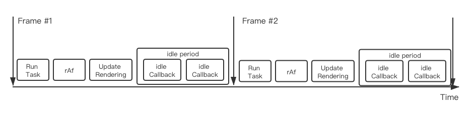
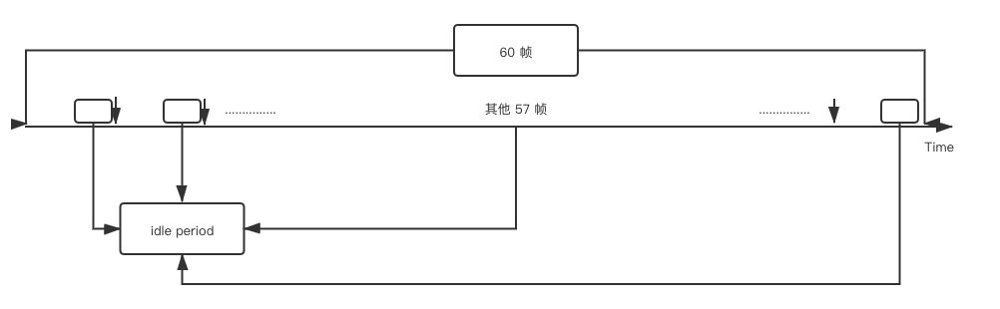

# 浏览器 fps、requestAnimationFrame() 以及 requestIdleCallback()

## 1. 前言
最近在研究 react 源码（v16.8）的过程中，发现 react 使用了 `requestAnimationFrame` 和 `requestIdleCallback` 这两个 api。同时，这两个 api 与 `浏览器的 fps` 存在着关系。

## 2. 浏览器的 fps

### 2.1. fps 是什么？

首先介绍一下一些名词的含义

- 帧：指显示器显示的每一张画面

fps 全称为 `Frames Per Second`，即 `每一秒的帧数`。我们在显示器上看到的各种各样的动画效果，都是由一帧一帧组成的。可以将 fps 理解为动画播放的速度。fps 越大，动画越流畅。

一般浏览器的 fps 为 60。当然，如果你的显示器的刷新率能够达到 144 hz 的话，浏览器的 fps 可以达到 144 fps

那什么是刷新率呢？`屏幕的刷新率` 是指 `屏幕每秒能够显示图像的次数`，单位为 hz（赫兹）。

fps 的值受限于屏幕的刷新率，即 `fps 的值小于等于屏幕刷新率的值`。

*总结：浏览器的 fps 指浏览器每一秒的帧数。fps 越大，每秒的画面就越多，浏览器的显示就越流畅。浏览器的 fps 一般等于屏幕的刷新率，不会超过屏幕的刷新率。*

## 3. requestAnimationFrame()

先看一下 [MDN 上对 `requestAnimationFrame()` 的定义](https://developer.mozilla.org/zh-CN/docs/Web/API/Window/requestAnimationFrame)：

> window.requestAnimationFrame() 告诉浏览器——你希望执行一个动画，并且要求浏览器在下次重绘之前调用指定的回调函数更新动画。该方法需要传入一个回调函数作为参数，该回调函数会在浏览器下一次重绘之前执行

> 当你准备更新动画时你应该调用此方法。这将使浏览器在下一次重绘之前调用你传入给该方法的动画函数(即你的回调函数)。`回调函数执行次数通常是每秒60次，但在大多数遵循W3C建议的浏览器中，回调函数执行次数通常与浏览器屏幕刷新次数相匹配`

- window.requestAnimationFrame() 会在浏览器重绘前调用传入的回调函数
- 回调函数的执行次数与浏览器的最大 fps 相等

### 范例

```javascript
var start = null;
var element = document.getElementById('SomeElementYouWantToAnimate');
element.style.position = 'absolute';

function step(timestamp) {
  if (!start) start = timestamp;
  var progress = timestamp - start;
  element.style.left = Math.min(progress / 10, 200) + 'px';
  if (progress < 2000) {
    window.requestAnimationFrame(step);
  }
}

window.requestAnimationFrame(step);
```
- `element.style.left` 的值会每 16.7ms（1000 / 60）变化一次，一秒变化 60 次，这样就形成了动画



- 如上图中的 `rAf` 就表示 requestAnimationFrame()。在 `Update Rendering`（更新渲染）前执行

requestAnimationFrame() 总结：

- 特点：requestAnimationFrame() 一定会在 `重绘前` 去执行传入的回调
- 优点：当requestAnimationFrame() 运行在 `后台标签页` 或者`隐藏的 <iframe> 里` 时，requestAnimationFrame() 会被暂停调用以提升性能和电池寿命

## 4. requestIdleCallback()
[MDN 上对 `requestIdleCallback()` 的定义](https://developer.mozilla.org/zh-CN/docs/Web/API/Window/requestAnimationFrame)：

> window.requestIdleCallback()方法将在浏览器的空闲时段内调用的函数排队。这使开发者能够在主事件循环上执行后台和低优先级工作，而不会影响延迟关键事件，如动画和输入响应

- 什么叫 `浏览器的空闲时间段` 呢？来看一下刚刚这张图：


在一个最大 fps 为 60 的浏览器中，每一帧的时间长度我们可以得出：1000 / 60 = 16.7ms。当浏览器在 `Update Rendering` 这个阶段以及之前的阶段所用的时间小于 16.7 ms 时，就会有 `idle time（空闲时间）`。这个 `idle time` 就是 `浏览器的空闲时间段`


- 再看下图。当浏览器动画达到最流畅的效果时（也就是 60 fps），浏览器给每一帧所分配的时间为 16.7ms。60 帧中，就有 60 个 `idle time`。这可不是一笔小的时间长度（这段时间不用白不用~）。

- 所以，在 react 中就会利用这段时间，将对于用户来说，不那么重要的任务放在 `idle time` 中执行。而对于用户体验来说比较重要的任务（如：动画、click 事件任务等）放在 `requestAnimationFrame()` 回调中执行。



- 当然，如果一直没有 `空闲时间`，`requestIdleCallback()` 的回调就会一直得不到调用。我们可以通过设置第二个的 `timeout 属性`，让 `requestIdleCallback()` 在 `timeout` 时间之后，必定执行。


## 5. 参考
- https://developer.mozilla.org/zh-CN/docs/Web/API/Window/requestAnimationFrame
- https://developer.mozilla.org/zh-CN/docs/Web/API/Window/requestIdleCallback
- http://www.zhangyunling.com/702.html
- https://juejin.im/post/5ad71f39f265da239f07e862
- https://www.w3.org/TR/requestidlecallback/#the-requestidlecallback-method